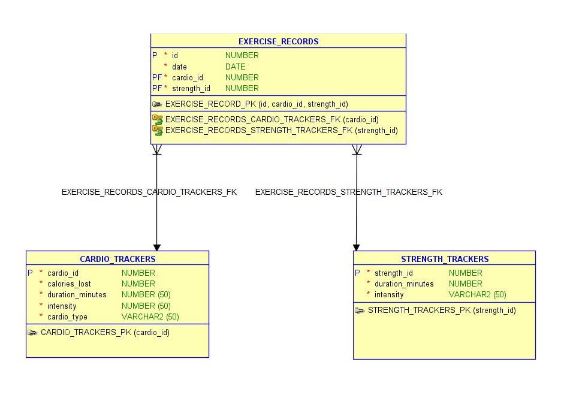

# Workout Tracker Application 🏋️‍♂️ 📊

A Flask-based web application for tracking workout sessions with both cardio and strength training components. This application helps users record, manage, and analyze their exercise data over time. This project is currently running on a Raspberry Pi 4 Model B with Raspberry Pi OS. The Pi is mounted in a 3D-printed case, along with a small LCD display that shows the current date and system information, including CPU temperature, IP address, SD card usage, and memory usage.

## Features

- Log workout sessions with date, calories burned, and exercise details
- Track cardio exercises with duration, intensity, and type
- Record strength training with duration and intensity metrics
- View workout history in chronological order
- Calculate total workout duration for each session
- Delete unwanted workout records

## Requirements

- Python 3.11+
- MariaDB/MySQL (database)
- Pipenv (for dependency management)
- Apache2 (web server)

## Project Structure

```
workout_webapp/
├── logs/               # Access and error logs
├── app.py              # Main application file
├── app.wsgi            # Web Server Gateway Interface; Bridge between a Python web app and a web server (Apache)
├── templates/
│   └── index.html      # Main page template
├── static/
│   └── style.css       # Main page styles
├── .env                # Environment variables (not in version control)
└── setup_venv.sh                # Sets up virtual environment
```

## Web App Installation

1. Clone the repository:
   ```bash
   git clone https://github.com/JosephG0918/FitTrack.git
   cd FitTrack/src
   ```

2. Install dependencies using Pipenv:
   
   Make sure you have pipenv installed. If not, install it using:
   ```
   pip install pipenv
   ```
   or
   ```
   sudo apt install pipenv
   ```
   
   Run the setup script to create the virtual environment and install dependencies:
   ```
   chmod +x setup_venv.sh
   ./setup_venv.sh
   ```

   If needed, install the required system dependencies for MariaDB:
   ```
   sudo apt install libmariadb-dev libmariadb-dev-compat
   ```

   More info about pipenv [here](https://pypi.org/project/pipenv/)

3. Create a `.env` file in the project root `FitTrack/src/FitTrack/var/workout_webapp` with your database credentials:
   ```
   DB_HOST=localhost
   DB_USER=your_database_user
   DB_PASS=your_database_password
   DB_PORT=3306
   ```

4. Set up the database:

   MariaDB installation guide [here](https://medium.com/better-programming/how-to-install-mysql-on-a-raspberry-pi-ad3f69b4a094)
   
   Create a database named `workout_db` and set up the required tables:

   ```sql
   CREATE DATABASE workout_db;
   USE workout_db;

   CREATE TABLE CARDIO_TRACKERS (
     cardio_id INT AUTO_INCREMENT PRIMARY KEY,
     calories_lost INT NOT NULL,
     duration_minutes INT NOT NULL,
     intensity VARCHAR(50) NOT NULL,
     cardio_type VARCHAR(50) NOT NULL
   );

   CREATE TABLE STRENGTH_TRACKERS (
     strength_id INT AUTO_INCREMENT PRIMARY KEY,
     duration_minutes INT NOT NULL,
     intensity VARCHAR(50) NOT NULL
   );

    CREATE TABLE EXERCISE_RECORDS (
    cardio_id INT NOT NULL,
    strength_id INT NOT NULL,
    date DATE NOT NULL,
    PRIMARY KEY (cardio_id, strength_id, date),
    FOREIGN KEY (cardio_id) REFERENCES CARDIO_TRACKERS(cardio_id),
    FOREIGN KEY (strength_id) REFERENCES STRENGTH_TRACKERS(strength_id)
    );
   ```

   Entity Relationship Diagram:
   

5. Set up Apache

   Apache installation guide [here](https://www.digitalocean.com/community/tutorials/how-to-install-the-apache-web-server-on-debian-11)

   Install Apache2:
   ```
   sudo apt install apache2
   ```

   Go into the `FitTrack/src/FitTrack` directory:
   ```
   cd FitTrack/src/FitTrack
   ```
   - `etc/` → Apache configuration file (move to `/etc/apache2/sites-available/`)
   - `var/` → Web application files (move `workout_webapp` to `/var/www/`)

   Enable the site configuration:
   ```
   sudo a2ensite workout-app.conf
   ```

   Verify it is enabled:
   ```
   ls /etc/apache2/sites-enabled/
   ```
   You should see `workout-app.conf` only.

   If you see any other enabled site configuration files, disable them using:
   ```
   sudo a2dissite <example.conf>
   ```

   Update `app.wsgi` with the correct user and venv (virtual environment) path:
   `activate_this = /home/<user>/.local/share/virtualenvs/<venv>/bin/activate_this.py`

   Install mod_wsgi and enable it:
   ```
   sudo apt install libapache2-mod-wsgi-py3
   sudo a2enmod wsgi
   ```

   Start Apache and check status:
   ```
   sudo systemctl start apache2
   ```
   ```
   sudo systemctl status apache2
   ```
   `apache2.service should` be `active`.

   If you want to do a clean reinstall of Apache:
   ```
   sudo apt purge apache2 apache2-bin apache2-data apache2-utils
   sudo apt autoremove
   sudo apt install apache2
   ```

6. Open your web browser and navigate to:
   ```
   http://localhost:80
   ```

## Usage

1. **Note for Linux users running ONLY the Flask app:**
   - Port 80 requires root privileges on Linux. If you encounter permission issues, modify the port in `app.py`:
     ```python
     # Change this line at the bottom of app.py
     app.run(host="0.0.0.0", port=5000, debug=True)
     ```
   - Then access the application at:
     ```
     http://localhost:5000
     ```

2. To add a new workout record:
   - Fill out the form with your workout details
   - Click "Add Record" to save the data

3. To delete a workout record:
   - Find the record in the workout history table
   - Click the delete or "x" button next to the record

## Security Notes

- The application uses a randomly generated secret key for Flask sessions
- Database credentials are stored in environment variables for security
- Connection management ensures proper resource cleanup

## LCD Display Installation

- A small LCD display shows the current date and Raspberry Pi system information, including CPU temperature, IP address, SD card usage, and memory usage.
- The display and Raspberry Pi are mounted in a 3D-printed case.

1. Create the cron job:
   ```
   sudo crontab -e
   ```

   What you should copy and paste:
   ```
   @reboot /usr/bin/python /home/<user>/FitTrack/src/LCD_project/LCD_Module_RPI_code/RaspberryPi/python/LCD_specs.py
   ```
   Make sure to replace `<user>` with your actual Pi username.

   Ensure the Python script is correctly configured: 
   `FitTrack/src/LCD_project/LCD_Module_RPI_code/RaspberryPi/python/LCD_specs.py`
   Update the font path to match your system user:
   ```
   font = ImageFont.truetype("/home/<user>/FitTrack/src/LCD_project/LCD_Module_RPI_code/RaspberryPi/python/Font/Font00.ttf", 23)
   ```
   This script runs at boot and displays system information on the LCD screen.

   Finally reboot the system:
   ```
   sudo reboot -h now
   ```

## Credits
- Claude AI helping write this readme file.

## License

This project is licensed under the MIT License - see the [LICENSE](LICENSE) file for details.

## Pictures


